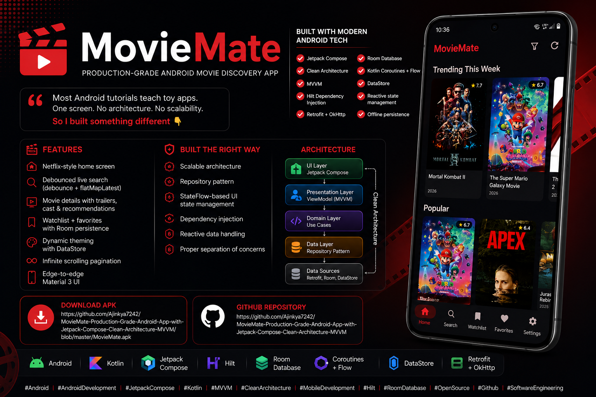

# 🎬 MovieMate

[](https://youtu.be/OUu5SxK1fJk)


A modern Android movie discovery app built with **Jetpack Compose**, **Clean Architecture**, and **MVVM**. Designed as a complete reference project for studying production-grade Android development.

> **Why this project?** Most Android tutorials are toy apps with one screen and zero architecture. MovieMate is the opposite — 12 screens, real network calls, local persistence, dependency injection, reactive flows, and a clean separation of concerns. It is a *study* repo: the comments on every file explain *why* the code is the way it is, not just *what* it does.

---

## 📥 Download APK

> **Grab the latest debug build and install it directly — no Android Studio needed.**

**[⬇️ Download MovieMate APK](./MovieMate.apk)**

> ⚠️ **TMDB API is blocked in some regions (including certain ISPs and countries).** If the app shows errors or loads nothing, **connect to a VPN** and relaunch the app. Any free VPN (ProtonVPN, Windscribe, etc.) with a US/EU server works.

---

## Table of Contents

1. [Features](#features)
2. [How to Use](#how-to-use)
3. [Setup (5 minutes)](#setup)
4. [Tech Stack](#tech-stack)
5. [Architecture Overview](#architecture)
6. [Folder Structure](#folder-structure)
7. [SOLID Principles in Practice](#solid-principles-in-practice)
8. [Suggested Learning Path](#suggested-learning-path)
9. [Patterns Worth Studying](#patterns-worth-studying)
10. [Possible Extensions](#extensions)
11. [Credits](#credits)

---

## <a name="features"></a>✨ Features

- **Splash + Onboarding** — first-run experience with a 3-page HorizontalPager
- **Home** — Netflix-style scroll of horizontal sections (Trending, Popular, Top Rated, Now Playing, Upcoming)
- **Search** — debounced live search (`debounce + flatMapLatest`) — no spam API calls
- **Movie Details** — backdrop header, trailer playback (YouTube), genres, cast carousel, similar & recommended movies
- **Cast & Crew** — full filmography with two tabs
- **Person Details** — biography, birthday, place of birth, filmography
- **Genres** — colorful gradient grid; tap to browse a paginated list
- **Genre Movies** — infinite-scroll paginated grid
- **Watchlist** — saved-for-later movies, persisted in Room
- **Favorites** — separate "loved" list, persisted in Room
- **Settings** — light / dark / system theme picker, persisted via DataStore
- **Offline-resilient** — saved lists work without network; per-section error handling on Home
- **Edge-to-edge UI** with Material 3 + system splash screen API

---

## <a name="how-to-use"></a>📱 How to Use

### Step 1 — Connect to a VPN
TMDB (The Movie Database) API is **blocked on many regular networks and ISPs** in several regions. The app will show empty screens or network errors without a VPN.

1. Install any free VPN — **ProtonVPN**, **Windscribe**, or **1.1.1.1 by Cloudflare** all work
2. Connect to a **US or European server**
3. Keep the VPN on while using the app

> If you see a "Something went wrong" error or the home screen is empty, the VPN is the fix.

### Step 2 — Install the APK
1. [Download the APK](#-download-apk) from the link above
2. On your Android device go to **Settings → Install unknown apps** and allow your browser or file manager
3. Open the downloaded `.apk` file and tap **Install**
4. Launch **MovieMate** from your home screen

### Step 3 — Explore
| Screen | How to reach it |
|---|---|
| **Home** | Opens automatically — scroll horizontal sections (Trending, Popular, Top Rated…) |
| **Search** | Tap the 🔍 icon in the bottom bar — type any movie title |
| **Movie Details** | Tap any movie poster anywhere in the app |
| **Play Trailer** | On the detail screen, tap the ▶ button on the backdrop image |
| **Fullscreen Video** | While the trailer plays, tap the fullscreen icon — rotate works automatically |
| **Genres** | Tap the grid icon in the bottom bar — tap a genre to browse its movies |
| **Watchlist** | Tap the 🔖 bookmark icon on any detail screen; view list via bottom bar |
| **Favorites** | Tap the ❤️ heart icon on any detail screen; view list via bottom bar |
| **Cast Details** | On a detail screen, tap any cast member's photo |
| **Settings** | Tap the ⚙️ icon — switch between Light / Dark / System theme |

---

## <a name="setup"></a>⚙️ Setup

### Prerequisites
- **Android Studio** — Hedgehog (2023.1.1) or newer
- **JDK 17** (bundled with Android Studio)
- **A free TMDB API key** (5-minute signup)

### Step 1 — Get a TMDB API Key
1. Visit [https://www.themoviedb.org/signup](https://www.themoviedb.org/signup)
2. Sign up (free)
3. Go to **Settings → API → Request an API key → Developer**
4. Fill out the form (any personal/non-commercial reason works)
5. Copy your **API Read Access Token** (the v3 auth key)

### Step 2 — Add the key to local.properties
Open `local.properties` at the project root and add:

```properties
TMDB_API_KEY="paste_your_key_here_with_quotes"
```

> ⚠️ `local.properties` is in `.gitignore` — it will never be committed. The key is exposed to your code via `BuildConfig.TMDB_API_KEY`.

### Step 3 — Build & Run
```bash
./gradlew assembleDebug
```
Or just hit **Run ▶** in Android Studio. Min SDK is **24** (Android 7.0), target SDK is **34** (Android 14).

### Step 4 — Use a VPN if TMDB is blocked
TMDB's API (`api.themoviedb.org`) is blocked by many ISPs and in several countries. If the app runs but shows errors or blank screens:

1. Install a VPN — **ProtonVPN** (free tier, no account required) or **Windscribe** work well
2. Connect to any **US or EU server**
3. Relaunch the app

> This is a TMDB network restriction, not a code bug. The app works perfectly once the API is reachable.

---

## <a name="tech-stack"></a>🛠️ Tech Stack

| Layer | Library |
|---|---|
| **UI** | Jetpack Compose, Material 3, Compose Navigation |
| **DI** | Hilt |
| **Networking** | Retrofit + OkHttp + kotlinx.serialization |
| **Image loading** | Coil |
| **Local DB** | Room |
| **Preferences** | DataStore |
| **Async** | Kotlin Coroutines + Flow |
| **Build** | Gradle Kotlin DSL + Version Catalog (`libs.versions.toml`) |
| **Lang** | Kotlin 2.0 |

The full version catalog lives in `gradle/libs.versions.toml` — one file, all dependencies, no string typos.

---

## <a name="architecture"></a>🏛️ Architecture

MovieMate uses **Clean Architecture** with three layers:

```
┌────────────────────────────────────────────────────────────────┐
│  PRESENTATION LAYER                                            │
│  ───────────────────                                           │
│  Compose Screens  →  ViewModels  →  StateFlow<UiState>         │
│                                                                │
│  Knows about: domain (calls use cases)                         │
│  Doesn't know: networking, databases, JSON, Room               │
└──────────────────────┬─────────────────────────────────────────┘
                       │ depends on
                       ▼
┌────────────────────────────────────────────────────────────────┐
│  DOMAIN LAYER  (pure Kotlin, no Android)                       │
│  ─────────────                                                 │
│  Models  +  Use Cases  +  Repository Interfaces                │
│                                                                │
│  Knows about: nothing else                                     │
│  Stable: this is the contract everyone else respects           │
└──────────────────────┬─────────────────────────────────────────┘
                       │ implemented by
                       ▼
┌────────────────────────────────────────────────────────────────┐
│  DATA LAYER                                                    │
│  ──────────                                                    │
│  Repository impls  +  Retrofit API  +  Room DAOs  +  DTOs      │
│                                                                │
│  Knows about: HTTP, SQL, JSON, network errors                  │
│  Hides this complexity behind domain interfaces                │
└────────────────────────────────────────────────────────────────┘
```

**The golden rule of Clean Architecture:** dependencies only point *inward*. Domain knows nothing. Data and Presentation both depend on Domain. They never depend on each other.

This is enforced by Hilt: presentation injects use cases, use cases injects repository interfaces, and Hilt binds the interfaces to data-layer implementations. Swap an implementation, and nothing else changes.

---

## <a name="folder-structure"></a>📁 Folder Structure

```
app/src/main/java/com/example/moviemate/
│
├── core/                          ← Cross-cutting concerns
│   ├── components/                ← Reusable Compose pieces (MoviePosterCard, ShimmerBox, etc.)
│   ├── di/                        ← Hilt modules (NetworkModule, DatabaseModule, RepositoryModule)
│   ├── navigation/                ← Screen sealed class, BottomNavItem
│   ├── theme/                     ← Color, Type, Theme, ThemePreference
│   └── utils/                     ← Resource<T>, AppException, Constants, NetworkErrorMapper
│
├── domain/                        ← The heart of the app — pure Kotlin
│   ├── model/                     ← Movie, MovieDetail, Genre, Credits, PersonDetail...
│   ├── repository/                ← Interfaces only
│   └── usecase/
│       ├── movies/                ← GetPopular, GetTopRated, GetTrending, etc.
│       ├── search/                ← SearchMovies
│       ├── details/               ← GetMovieDetails, GetMovieCredits, GetMovieVideos...
│       ├── watchlist/             ← Toggle, Observe, IsIn, Clear
│       └── favorites/             ← Toggle, Observe, IsFavorite, Clear
│
├── data/                          ← The boring "make it work" layer
│   ├── remote/
│   │   ├── api/                   ← TmdbApi (Retrofit interface)
│   │   ├── dto/                   ← Wire-format JSON classes
│   │   └── interceptor/           ← ApiKeyInterceptor (appends ?api_key=...)
│   ├── local/
│   │   ├── dao/                   ← SavedMovieDao
│   │   ├── entity/                ← SavedMovieEntity (composite PK!)
│   │   ├── database/              ← MovieMateDatabase (Room)
│   │   └── preferences/           ← UserPreferencesRepository (DataStore)
│   ├── mapper/                    ← DTO ↔ Domain converters
│   └── repository/                ← Implementations of domain interfaces
│
├── presentation/
│   ├── splash/                    ← Splash screen + ViewModel
│   ├── onboarding/                ← 3-page intro
│   ├── home/                      ← 5 sections of horizontal LazyRows
│   ├── search/                    ← Debounced search with grid results
│   ├── details/                   ← Movie detail screen
│   ├── castcrew/                  ← Tab view of cast + crew
│   ├── person/                    ← Person bio + filmography
│   ├── genres/                    ← Gradient grid of genres
│   ├── genremovies/               ← Paginated movies for one genre
│   ├── watchlist/                 ← Saved movies grid
│   ├── favorites/                 ← Loved movies grid
│   ├── settings/                  ← Theme picker
│   ├── common/                    ← Shared components (SavedMovieGrid, BottomBar)
│   ├── MovieMateNavHost.kt        ← The nav graph — every route in one file
│   └── MovieMateApp.kt            ← Top-level scaffold
│
├── MainActivity.kt                ← The single Activity
└── MovieMateApplication.kt        ← @HiltAndroidApp
```

---

## <a name="solid-principles-in-practice"></a>🧱 SOLID Principles in Practice

Real examples from this codebase:

### **S** — Single Responsibility Principle
Each class does **one** thing.
- `SearchMoviesUseCase` only validates and runs a search. It doesn't know about UI, doesn't know about Retrofit. → `domain/usecase/search/SearchMoviesUseCase.kt`
- `ApiKeyInterceptor` only appends the API key to URLs. → `data/remote/interceptor/ApiKeyInterceptor.kt`
- `MoviePosterCard` only renders a poster. It doesn't load data, doesn't decide navigation. → `core/components/MoviePosterCard.kt`

### **O** — Open/Closed Principle
Add features without modifying old code.
- New movie section on Home? Add a new `Get…UseCase` and inject it into `HomeViewModel`. The repository stays untouched.
- New theme variant? Add an enum value to `ThemePreference`. The DataStore writer doesn't change.

### **L** — Liskov Substitution Principle
Subtypes work wherever the parent works.
- `MovieRepositoryImpl` is a drop-in replacement for the `MovieRepository` interface. Tests can supply a `FakeMovieRepository` that returns canned data, no other code needs to change. The use cases work identically.

### **I** — Interface Segregation Principle
Small interfaces > big god interfaces.
- We have **three** repository interfaces: `MovieRepository` (TMDB), `WatchlistRepository`, `FavoritesRepository`. The `WatchlistViewModel` only needs the watchlist one. It doesn't import a single TMDB type.

### **D** — Dependency Inversion Principle
ViewModels depend on **abstractions** (use cases / interfaces), not concretions.
- `HomeViewModel`'s constructor takes 5 use case interfaces. It has no idea Retrofit even exists.
- `RepositoryModule.kt` (`@Binds`) is where the abstract→concrete wiring happens — one tiny file, one source of truth.

---

## <a name="suggested-learning-path"></a>🎓 Suggested Learning Path

If you're studying this repo, follow this order to build mental models layer by layer.

### Phase 1 — The Vocabulary (start here)
1. `core/utils/Resource.kt` — understand the `Loading / Success / Error` sealed class. **Every** screen uses this pattern.
2. `core/utils/AppException.kt` + `NetworkErrorMapper.kt` — see how a raw `IOException` becomes a friendly user message.
3. `domain/model/Movie.kt` — domain models are *clean*. No annotations, no nullability noise. Compare with `data/remote/dto/MovieListResponseDto.kt` to see the contrast.

### Phase 2 — One Vertical Slice (the search screen)
Trace a single feature top-to-bottom. Search is the simplest:
1. `domain/usecase/search/SearchMoviesUseCase.kt` — minimal use case
2. `domain/repository/MovieRepository.kt` — see the `searchMovies` interface
3. `data/repository/MovieRepositoryImpl.kt` — the implementation, with `safeApiCall`
4. `data/remote/api/TmdbApi.kt` — the Retrofit declaration
5. `data/mapper/MovieMapper.kt` — DTO → domain conversion
6. `presentation/search/SearchViewModel.kt` — the **debounced reactive pipeline** is the gem here
7. `presentation/search/SearchScreen.kt` — `when (state.results) { ... }` UI rendering

### Phase 3 — Dependency Injection
Open `core/di/` and read all three modules in order:
1. `NetworkModule.kt` — Retrofit, OkHttp, JSON config
2. `DatabaseModule.kt` — Room
3. `RepositoryModule.kt` — `@Binds` for interface→implementation

Then look at any ViewModel — notice how its constructor lists *exactly* what it needs, no more, no less. Hilt makes this trivial.

### Phase 4 — Reactive Architecture
1. `presentation/watchlist/WatchlistViewModel.kt` — see how a Flow from Room becomes a `StateFlow<List<Movie>>` with **zero** manual refresh code
2. `presentation/details/MovieDetailViewModel.kt` — `watchlistState` is a Flow that updates the UI the instant the DB row changes — you tap "save" on the detail screen, the watchlist tab is already updated when you switch to it

### Phase 5 — The Tricky Stuff
1. `presentation/genremovies/GenreMoviesViewModel.kt` + Screen — manual pagination with `snapshotFlow + distinctUntilChanged`
2. `presentation/MovieMateNavHost.kt` — the entire nav graph, with typed nav arguments
3. `presentation/common/MovieMateBottomBar.kt` — `popUpTo + saveState/restoreState` for proper tab back-stack handling

---

## <a name="patterns-worth-studying"></a>🔍 Patterns Worth Studying

Pull these out of the codebase and study them in isolation:

| Pattern | Where | Why it matters |
|---|---|---|
| **Stateful/Stateless composables** | `SplashScreen` calls `SplashContent(...)` | Testable, previewable, reusable |
| **Resource<T> sealed class** | `core/utils/Resource.kt` | Eliminates "is loading + has data + has error" booleans |
| **Use Cases as `operator fun invoke`** | All `domain/usecase/...` | Call site is `getPopular()`, not `getPopular.execute()` |
| **safeApiCall helper** | `MovieRepositoryImpl.kt` | Centralized try/catch — no boilerplate per method |
| **Composite primary key in Room** | `SavedMovieEntity.kt` (`[id, type]`) | One table, two lists (watchlist + favorites) |
| **debounce + flatMapLatest** | `SearchViewModel.kt` | The textbook reactive search pattern |
| **SavedStateHandle for nav args** | `MovieDetailViewModel.kt` | Activity restoration safe; survives process death |
| **`stateIn` with `WhileSubscribed(5_000)`** | Many ViewModels | The 5-second grace period is **deliberate** — it survives configuration changes without restarting flows |
| **API key via BuildConfig** | `app/build.gradle.kts` | Key never goes into git; per-developer setup |

---

## <a name="extensions"></a>🚀 Possible Extensions

If you want to extend the project for practice:

1. **Replace manual pagination with Paging 3** — the dependency is already declared
2. **Add unit tests** — turbine is already on the classpath. Start with `SearchViewModelTest`
3. **Add TV shows** — TMDB has the same shape for `/tv/...`. Most of your code already accepts a `Movie` model that could be widened to `Media`
4. **Offline caching** — Room is already configured. Cache the last "popular" page and read it when offline
5. **Multi-module split** — promote `core`, `domain`, `data`, `presentation` to separate Gradle modules. The folder boundaries are already there
6. **Custom transitions** — try `AnimatedNavHost` with shared element transitions on the poster→detail screen

---

## <a name="credits"></a>🙏 Credits

- **Movie data** — [The Movie Database (TMDB)](https://www.themoviedb.org). This product uses the TMDB API but is **not endorsed or certified by TMDB**.
- **Built for learning** — every comment in the source is a tiny lesson. Read them.

---

## License

MIT — do whatever you want with this code. Build something cool.
